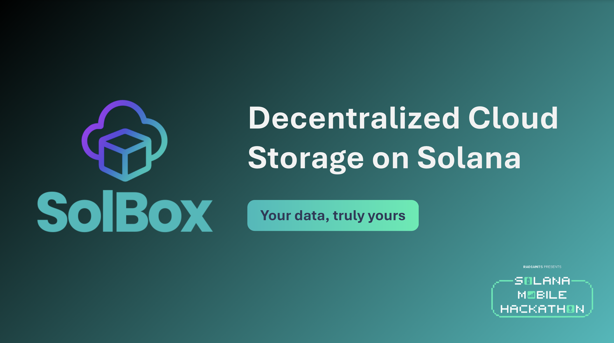

# 💫 SolBox:
SolBox lets users upload files with permanent on-chain records powered by Solana — fast, affordable, censorship-resistant, and secured with evolving encryption patterns designed for real ownership. Soon, SolBox will go fully decentralized, turning users into storage hosts who earn by contributing space — replacing cloud monopolies with a community-driven, trustless storage network.

## 🌐 Socials:
 
  

[Telegram](t.me/solbox.cloud) [Website](Solbox.cloud)

# 💻 Tech Stack:
           

---

<!-- Proudly created with GPRM ( https://gprm.itsvg.in ) -->
